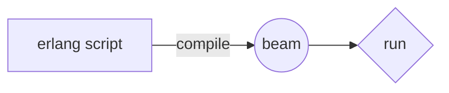

# Erlang Poc

### run erlang shell
`erl`

### access path:
`cd("/home/user/erlang-poc")`

### compile it:
`c(tut).`

### run:
`tut:hello_world().`

Hello World
ok

```mermaid
graph LR
A[erlang script] -- compile --> B((beam))
B --> D{run}
```
